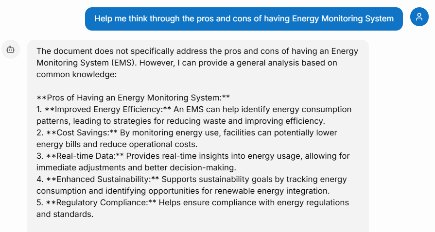
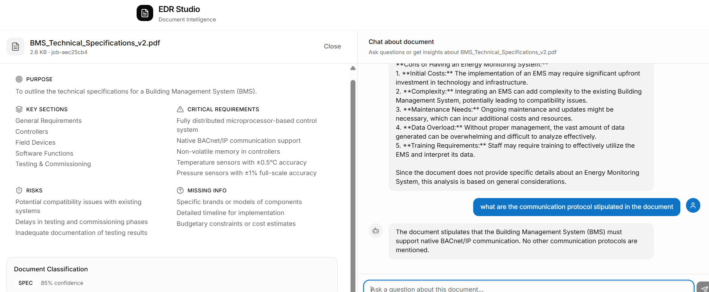

<p align = "center" draggable="false" >
</p>

<h1 align="center" id="heading">Session 1: Introduction and Vibe Check</h1>

### [Quicklinks](https://github.com/AI-Maker-Space/AIE9/tree/main/00_AIE_Quicklinks)

| 📰 Session Sheet | ⏺️ Recording     | 🖼️ Slides        | 👨‍💻 Repo         | 📝 Homework      | 📁 Feedback       |
|:-----------------|:-----------------|:-----------------|:-----------------|:-----------------|:-----------------|
| [Vibe Check!](../00_Docs/Session_Sheets/01_Vibe_Check.md) |[Recording!](https://drive.google.com/file/d/1Rsmm0Hld3WFHRxhZpEDLN_JREQ43yhwu/view?usp=drive_link) | [Session 1 Slides](https://www.canva.com/design/DAG-EBzN2PQ/gE9-Uma217yych4M7GCjSw/edit?utm_content=DAG-EBzN2PQ&utm_campaign=designshare&utm_medium=link2&utm_source=sharebutton) | You are here! | [Session 1 Assignment: Vibe Check](https://forms.gle/NeN59bCLdtXvwzVJ9) | [Feedback 1/13](https://forms.gle/1im4nmYK9cW9MFEk6) |

## 🏗️ How AIM Does Assignments

> 📅 **Assignments will always be released to students as live class begins.** We will never release assignments early.

Each assignment will have a few of the following categories of exercises:

- ❓ **Questions** – these will be questions that you will be expected to gather the answer to! These can appear as general questions, or questions meant to spark a discussion in your breakout rooms!

- 🏗️ **Activities** – these will be work or coding activities meant to reinforce specific concepts or theory components.

- 🚧 **Advanced Builds (optional)** – Take on a challenge! These builds require you to create something with minimal guidance outside of the documentation. Completing an Advanced Build earns full credit in place of doing the base assignment notebook questions/activities.

### Main Assignment

In the following assignment, you are required to take the app that you created for the AIE9 challenge (from [this repository](https://github.com/AI-Maker-Space/The-AI-Engineer-Challenge)) and conduct what is known, colloquially, as a "vibe check" on the application.

You will be required to submit a link to your GitHub, as well as screenshots of the completed "vibe checks" through the provided Google Form!

> NOTE: This will require you to make updates to your personal class repository, instructions on that process can be found [here](https://github.com/AI-Maker-Space/AIE9/tree/main/00_Docs/Prerequisites/Initial_Setup)!


#### A Note on Vibe Checking

>"Vibe checking" is an informal term for cursory unstructured and non-comprehensive evaluation of LLM-powered systems. The idea is to loosely evaluate our system to cover significant and crucial functions where failure would be immediately noticeable and severe.
>
>In essence, it's a first look to ensure your system isn't experiencing catastrophic failure.

---
vercel deployed app: v0-edr-prototype.vercel.app
#### 🏗️ Activity #1: General Vibe Checking Evals

Please evaluate your system on the following questions:

1. Explain the concept of object-oriented programming in simple terms to a complete beginner.
    - Aspect Tested:
2. Read the following paragraph and provide a concise summary of the key points…
    - Aspect Tested:
3. Write a short, imaginative story (100–150 words) about a robot finding friendship in an unexpected place.
    - Aspect Tested:
4. If a store sells apples in packs of 4 and oranges in packs of 3, how many packs of each do I need to buy to get exactly 12 apples and 9 oranges?
    - Aspect Tested:
5. Rewrite the following paragraph in a professional, formal tone…
    - Aspect Tested:

#### ❓Question #1:

Do the answers appear to be correct and useful?
##### ✅ Answer: Looks like structured and confident answers. however, many of the answers are hallucination.

---

#### 🏗️ Activity #2: Personal Vibe Checking Evals (Your Assistant Can Answer)

Now test your assistant with personal questions it should be able to help with. Try prompts like:

- "Help me think through the pros and cons of [enter decision you're working on making]."
- "What are the pros and cons of [job A] versus [job B] as the next step in my career?"
- "Draft a polite follow-up [email, text message, chat message] to a [enter person details] who hasn't responded."
- "Help me plan a birthday surprise for [person]."
- "What can I cook with [enter ingredients] in fridge."

##### Your Prompts and Results:
1. Prompt: what are the main section of the document?
   - Result: The main sections of the document are:
1. General Requirements
2. Controllers
3. Field Devices
4. Software Functions
5. Testing & Commissioning
2. Prompt: do we have a section for scope of work?
   - Result: The document context does not mention a section for the scope of work.
3. Prompt:Help me think through the pros and cons of having Energy Monitoring System
   - Result: he document does not specifically address the pros and cons of having an Energy Monitoring System (EMS). However, I can provide a general analysis based on common knowledge:

**Pros of Having an Energy Monitoring System:**
1. **Improved Energy Efficiency:** An EMS can help identify energy consumption patterns, leading to strategies for reducing waste and improving efficiency.
2. **Cost Savings:** By monitoring energy use, facilities can potentially lower energy bills and reduce operational costs.
3. **Real-time Data:** Provides real-time insights into energy usage, allowing for immediate adjustments and better decision-making.
4. **Enhanced Sustainability:** Supports sustainability goals by tracking energy consumption and identifying opportunities for renewable energy integration.
5. **Regulatory Compliance:** Helps ensure compliance with energy regulations and standards.


#### ❓Question #2:

Are the vibes of this assistant's answers aligned with your vibes? Why or why not?
##### ✅ Answer:
The app provide sections that are not exisit in the document given.
---

#### 🏗️ Activity #3: Personal Vibe Checking Evals (Requires Additional Capabilities)

Now test your assistant with questions that would require capabilities beyond basic chat, such as access to external tools, APIs, or real-time data. Try prompts like:

- "What does my schedule look like tomorrow?"
- "What time should I leave for the airport?"

##### Your Prompts and Results:
1. Prompt:can you send email with the missing info to medhat.elbanna1@gmail.com?

   - Result:I cannot send emails or directly communicate with individuals. However, I can help you draft an email to request the missing information. Here’s a suggestion:

---

Subject: Request for Additional Information on Building Management System Specifications

Dear [Recipient's Name],

I hope this message finds you well. I am currently reviewing the technical specifications for the Building Management System (BMS) and have identified some missing information that would be helpful for our project.

Could you please provide details on the following:

1. Specific brands or models of components to be used in the system.
2. A detailed timeline for the implementation of the BMS.
3. Any budgetary constraints or cost estimates related to the project.
Thank you for your assistance. I look forward to your prompt response.

Note: The app doesn't link with missing info. section that provided previously.
2. Prompt:
   - Result:

   

#### ❓Question #3:

What are some limitations of your application?
##### ✅ Answer:

First the app fake sections that doesn't exit in the document given.
Second the app are not able to link with keywords in the documents such as "software function"


This "vibe check" now serves as a baseline, of sorts, to help understand what holes your application has.

### 🚧 Advanced Build (OPTIONAL):

Please make adjustments to your application that you believe will improve the vibe check you completed above, then deploy the changes to your Vercel domain [(see these instructions from your Challenge project)](https://github.com/AI-Maker-Space/The-AI-Engineer-Challenge/blob/main/README.md) and redo the above vibe check.

> NOTE: You may reach for improving the model, changing the prompt, or any other method.

#### 🏗️ Activity #1
##### Adjustments Made:
- _describe adjustment(s) here_

##### Results:
1. _Comment here how the change(s) impacted the vibe check of your system_
2.
3.
4.
5.


## Submitting Your Homework
### Main Assignment
Follow these steps to prepare and submit your homework:
1. Pull the latest updates from upstream into the main branch of your AIE9 repo:
    - For your initial repo setup see [Initial_Setup](https://github.com/AI-Maker-Space/AIE9/tree/main/00_Docs/Prerequisites/Initial_Setup)
    - To get the latest updates from AI Makerspace into your own AIE9 repo, run the following commands:
    ```
    git checkout main
    git pull upstream main
    git push origin main
    ```
2. **IMPORTANT:** Start Cursor from the `01_Prototyping_Best_Practices_and_Vibe_Check` folder (you can also use the _File -> Open Folder_ menu option of an existing Cursor window)
3. Edit this `README.md` file (the one in your `AIE9/01_Prototyping_Best_Practices_and_Vibe_Check` folder)
4. Complete all three Activities:
    - **Activity #1:** Evaluate your system using the general vibe checking questions and define the "Aspect Tested" for each
    - **Activity #2:** Test your assistant with personal prompts it should be able to answer
    - **Activity #3:** Test your assistant with prompts requiring additional capabilities
5. Provide answers to all three Questions (`❓Question #1`, `❓Question #2`, `❓Question #3`)
6. Add, commit and push your modified `README.md` to your origin repository's main branch.

When submitting your homework, provide the GitHub URL to your AIE9 repo.

### The Advanced Build:
1. Follow all of the steps (Steps 1 - 6) of the Main Assignment above
2. Document what you changed and the results you saw in the `Adjustments Made:` and `Results:` sections of the Advanced Build
3. Add, commit and push your additional modifications to this `README.md` file to your origin repository.

When submitting your homework, provide the following on the form:
+ The GitHub URL to your AIE9 repo.
+ The public Vercel URL to your updated Challenge project on your AIE9 repo.
